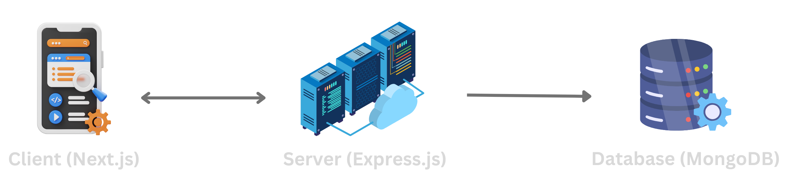

# Roots2Goods

**Roots2Goods** is a comprehensive agro supply chain management platform designed to eliminate third-party syndicates and bring transparency, traceability, and fairness to the agricultural product flow from farmers to wholesalers.

By digitizing and tracking every transaction in the supply chain, Roots2Goods empowers each stakeholder with tools to manage inventory, analyze profits, and maintain transparent trade practices.


## 🌾 What is Roots2Goods?

Roots2Goods addresses the inefficiencies and exploitation in the agro supply chain. The platform enables:

### 👨‍🌾 Farmer
- Create an account, log in, and start new projects.
- Record and track expenses, create product listings for sale.
- Sell products directly to traders with offer management.
- View detailed product analytics (expenses, revenue, profit, stock).
- Access full business dashboard with transaction logs and visual charts.

### 🤝 Trader
- Create an account and explore farmer listings.
- View detailed product info, contact farmers directly.
- Send and manage purchase offers.
- Complete transactions including transport and billing (with distance-based cost via Google Maps API).
- Manage acquired stock and re-list products for wholesalers.
- Analyze business performance via dashboards and charts.

### 🏬 Wholesaler
- Browse and purchase products listed by traders.
- Access business analytics and performance insights.

### 🛠️ Administrator
- Monitor platform-wide transactions, profits, and revenues.
- Visualize real-time analytics across all users and operations.
- Control the **Price Bound** feature to set profit margin limits per product to prevent exploitation.


## ✅ Key Benefits

- **📦 End-to-End Product Traceability**  
  Every product is tracked from farmer to wholesaler, ensuring full visibility at each step of the supply chain.

- **📊 Real-Time Business Analytics**  
  Stakeholders can track revenue, expenses, and profits with interactive dashboards and graphical summaries.

- **💬 Transparent Communication**  
  Built-in offer and transaction flow between farmer and trader supports negotiation and direct contact.

- **🚚 Smart Logistics with Google Maps API**  
  Automatically calculates transportation costs based on actual distance to ensure fair and transparent pricing.

- **🔐 Fair Market Control with Admin Oversight**  
  Admin can enforce fair trade rules through the Price Bound system, promoting ethical profit margins and healthy competition.

- **📈 Empowerment Through Data**  
  Farmers, traders, and wholesalers gain critical insights into their business activities and growth potential.


Roots2Goods transforms agro-commerce into a transparent, fair, and scalable ecosystem, rooted in trust, growing with data.


## 🏗️ Project Architecture

**Roots2Goods** follows a modern, full-stack JavaScript architecture to ensure scalability, performance, and smooth developer experience.

### 🔹 Overview


### 🖥️ Frontend: Next.js

- Built using **Next.js**, a React-based framework with server-side rendering and optimized performance.
- Provides user interfaces and role-based dashboards for:
  - Farmers
  - Traders
  - Wholesalers
  - Administrator
- Features include dynamic forms, data visualizations (charts, graphs), Google Maps API integration, and responsive design.

---

### 🌐 Backend: Express.js

- Handles all RESTful API operations, including:
  - User authentication and role management
  - CRUD operations for projects, offers, products, transactions, and pricing
  - Business analytics processing
- Acts as the middleware between the client and the database.
- Manages role-specific workflows and enforces business rules (e.g., offer approval, price bounds).

---

### 🗄️ Database: MongoDB

- A flexible and scalable NoSQL database used to store:
  - User profiles and roles
  - Product details, project data, and transactions
  - Business analytics, expenses, revenues, and stock data
  - Admin configurations (e.g., profit limits per product)
- MongoDB enables rapid iteration with dynamic schemas, perfect for evolving business models.

---

This architecture ensures:

- 📦 Modular and scalable development  
- 🔐 Role-based data access and operations  
- 📊 Real-time analytics across the platform  
- ⚡ High performance and low latency for critical workflows


---

## ⚙️ Installation & Setup

To run **Roots2Goods** locally, follow the steps below. The project is divided into three main directories:

- `client` – Frontend for Farmers, Traders, and Wholesalers
- `admin` – Dashboard for Administrators
- `server` – Express.js Backend API

---

### 1️⃣ Clone the Repository

```bash
git clone https://github.com/srniloy/Roots2Goods-v2.git
cd Roots2Goods-v2
```
### 🌾 Client Setup (Next.js – Farmer, Trader, Wholesaler UI)

```bash
cd client

# Create a .env file and add the following:
# NEXT_PUBLIC_SERVER_URL=http://localhost:your_server_port
# BCRYPT_SALT=your_bcrypt_salt
# JWT_KEY=your_jwt_key
# REACT_APP_GOOGLE_MAPS_API_KEY=your_google_maps_api_key

npm install
npm run dev
```

### 🛠️ Admin Dashboard Setup (Next.js – Administrator UI)

```bash
cd admin

# Create a .env file and add the following:
# NEXT_PUBLIC_SERVER_URL=http://localhost:your_server_port
# BCRYPT_SALT=your_bcrypt_salt
# JWT_KEY=your_jwt_key

npm install
npm run dev
```

### 🌐 Server Setup (Express.js Backend)

```bash
cd server

# Create a .env file and add the following:
# PORT=your_port
# MONGO_SERVER_URL=your_mongodb_connection_string
# TokenSecret=your_jwt_secret
# SaltRounds=your_salt_rounds_value

npm install
npm run dev
```

---

## 🚀 Live Demo & Test Credentials

You can try **Roots2Goods** live on Vercel!

### 🔗 Live URLs

- 🌾 **Farmer / Trader / Wholesaler App**:  
  [https://roots2goods.vercel.app](https://roots2goods.vercel.app)

- 🛠️ **Admin Dashboard**:  
  [https://roots2goods-admin.vercel.app](https://roots2goods-admin.vercel.app)

---

### 🧪 Test Credentials

Use the following dummy accounts to explore the app's features:

#### 👨‍🌾 Farmer
```txt
📱 Phone: 01912341201  
🔑 Password: 123
```


#### 🤝 Trader

```txt
📱 Phone: 01912341206  
🔑 Password: 123
```

#### 🏬 Wholesaler
```txt
📱 Phone: 01912341211
🔑 Password: 123
```

#### 🛡️ Administrator
```txt
📧 Email: admin@roots2goods.com  
🔑 Password: 123
```